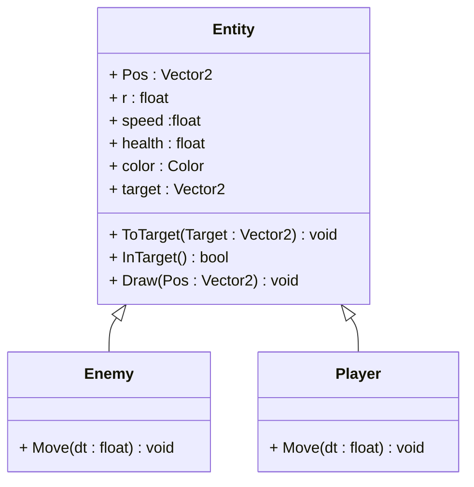

# Info

基于raylib

# 动画问题

1. 写死: 受帧率影响
  解决方案: 移动与帧率挂钩
2. 斜方向速度1.4倍

# 架构

```mermaid
classDiagram
    class Entity{
        + Pos : Vector2
        + r : float
        + speed :float
        + health : float
        + color : Color
        + target : Vector2

        + ToTarget(Target : Vector2) void
        + InTarget() bool
        + Draw(Pos : Vector2) void
    }

    class Enemy{
        + Move(dt : float) void
    }
    class Player{
        + Move(dt : float) void
    }
    Entity <|-- Enemy
    Entity <|-- Player
```
