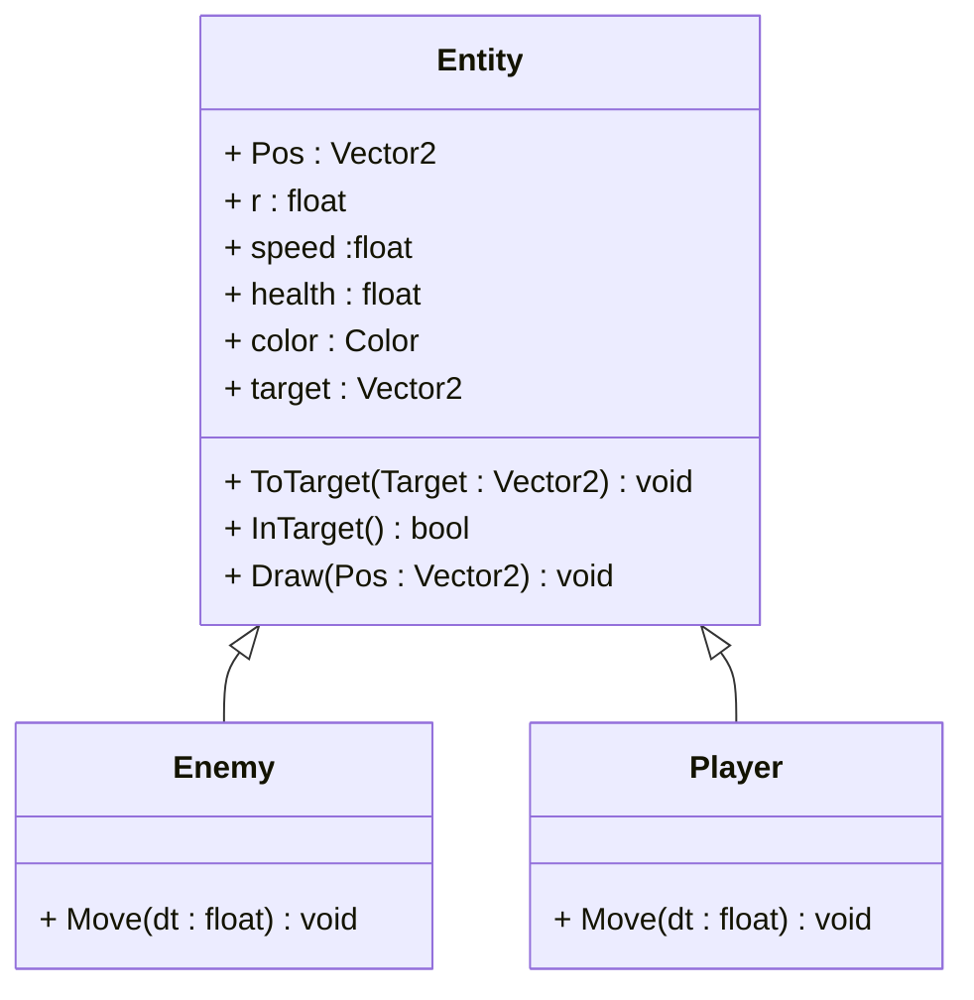

# Info

基于raylib

# 动画

1. x += dx * speed
  没有时间增量, 1s内移动的距离与帧率相关
2. x += dx * speed * dt
  引入时间增量, 保证1s内移动的距离相等
3. x += dv * dt
  速度矢量化, 移动不修改位置, 而是赋予实体一个速度
4. x += (da * dt) *dt

# 架构

```mermaid
classDiagram
    class Entity{
        + Pos : Vector2
        + r : float
        + speed :float
        + health : float
        + color : Color
        + target : Vector2

        + ToTarget(Target : Vector2) void
        + InTarget() bool
        + Draw(Pos : Vector2) void
    }

    class Enemy{
        + Move(dt : float) void
    }
    class Player{
        + Move(dt : float) void
    }
    Entity <|-- Enemy
    Entity <|-- Player
```
